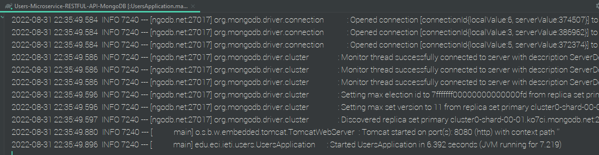
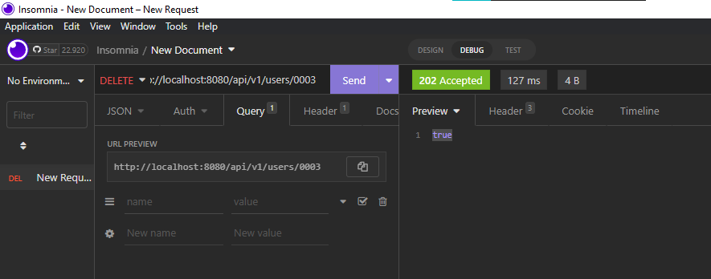

# Users-Microservice-RESTFUL-API - Data MongoDB


In this practice the integration of a non-relational database (MongoDb) with a level 2 Users Microservice RESTFUL API is realized. 

IETI - LAB02

2022-2.


## Development

This project is the continuation of the project 

[ Users-Microservice-RESTFUL-API ](https://github.com/ZulyVargas/Users-Microservice-RESTFUL-API.git) 


and is developed following the steps of the following repository

[ spring-boot-data-mongodb ](https://github.com/CAPJackie/spring-boot-data-mongodb) 

#### Project structure


### Prerequisites


* [Gradle](https://gradle.org) - Management tool used for projects build, dependency and documentation. 
* [Java ](https://www.oracle.com/co/java/technologies/javase/javase-jdk8-downloads.html)     - Programming language and computing platform.


### Installing

To download the project run:

  ```bash
    git clone https://github.com/ZulyVargas/Users-Microservice-RESTFUL-API-MongoDB.git
  ```

Run in Users-Microservice-RESTFUL-API-MongoDB:

```bash
    gradle build
    gradlew bootRun
```
If you have problems, run the application from your editor of choice, suggest: **IntelliJ**.

It is necessary to add the environment variable that allows the connection to the database in the cluster of the mongodb account.. 


 

***Example***




## Running the tests

Each API endpoint was tested with the INSOMNIA tool.

1. (GET) /api/v1/users/ getAll(): 

Initially there are two users registered in mongodb so they should be returned. 


2. (POST) /api/v1/users/ create():


3. (GET) /api/v1/users/{id} findById():


4. (PUT) /api/v1/users/{id} update():


5. (GET) /api/v1/users getAll() again with more users:


6. (DELETE) /api/v1/users/{id}:



After:


*Challenge Yourself: Implement complex queries using the Spring Data Query Methods Part*

1. Name or Last name Like:


Users with a first name or surname containing "Number" are obtained.

2. Users creared after a given date:


users created after August 24.


users created after September 2nd.

## Built With

* [IntelliJ IDEA](https://www.jetbrains.com/help/idea/discover-intellij-idea.html) - Integrated development environment written in Java for developing computer software.
* [Gradle](https://gradle.org) - Management tool used for projects build, dependency and documentation.
* [Java ](https://www.oracle.com/co/java/technologies/javase/javase-jdk8-downloads.html)     - Programming language and computing platform.


## Authors

* **Zuly Valentina Vargas Ramírez** 